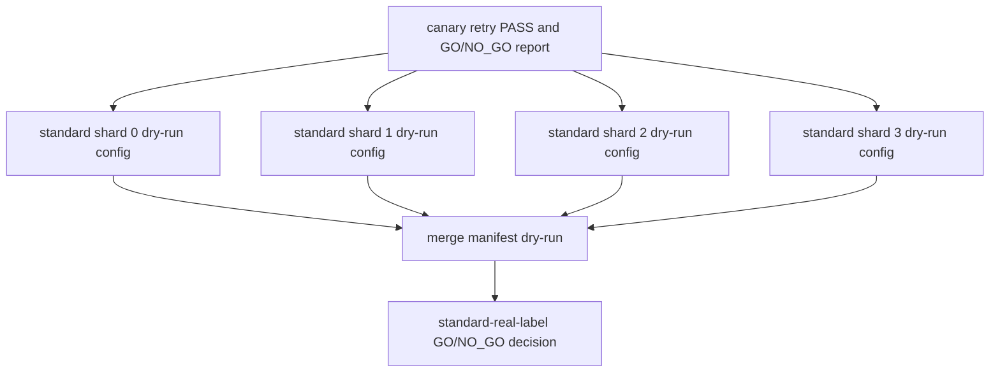

# SHA-X Standard-RealLabel 4-Shard Dry-Run Dependency Graph

Date: `2026-06-11`

Status: dry-run plan only. No `sbatch` command should be run from this document or from GitHub Actions.

## Dependency Graph

## Shard Contract

| shard | dependency | dry-run output | execution status |
|---:|---|---|---|
| 0 | canary retry pass | shard 0 config/manifest only | NOT_SUBMITTED |
| 1 | canary retry pass | shard 1 config/manifest only | NOT_SUBMITTED |
| 2 | canary retry pass | shard 2 config/manifest only | NOT_SUBMITTED |
| 3 | canary retry pass | shard 3 config/manifest only | NOT_SUBMITTED |

## Locks

- Do not run standard until canary retry completes and user confirms.
- Do not submit any 4-shard job from GitHub Actions.
- Do not upload labels or model weights to GitHub.
- Do not use NTU or Kaggle credentials.
